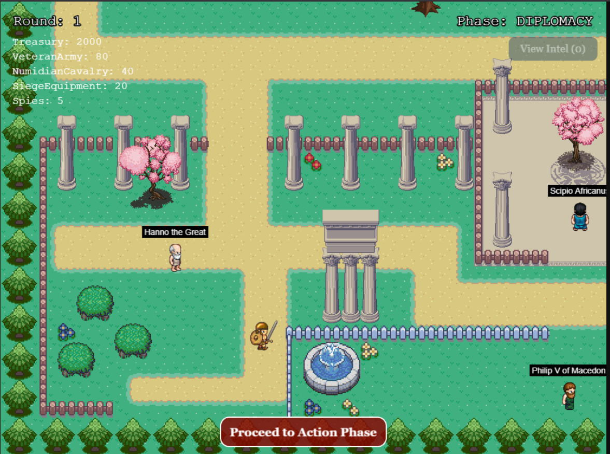
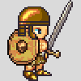

# Clash of Titans — Game Client 🎮



Welcome to the Clash of Titans Game Client, the interactive UI that places you directly into the heart of a historical crisis. As a delegate, you will navigate treacherous political landscapes, forge secret alliances, and make the strategic decisions that will shape the fate of empires.

# Overview
This web-based game client renders the world of your chosen historical scenario. Built with Phaser 3, it provides a top-down, explorable environment where you can interact with other AI-powered historical figures. The client connects to the powerful multi-agent backend, which drives the simulation's turn-based logic, AI behavior, and the secret "Undergame" narrative.


# Getting Started

## Requirements

[Node.js](https://nodejs.org) is required to install dependencies and run scripts via `npm`. If you don't want to install Node.js, you can use the Docker container.

## Available Commands

| Command               | Description                                                                                              |
|-----------------------|----------------------------------------------------------------------------------------------------------|
| `npm install`         | Install project dependencies                                                                             |
| `npm run dev`         | Launch a development web server                                                                          |
| `npm run build`       | Create a production build in the `dist` folder                                                           |
| `npm run dev-nolog`   | Launch a development web server without sending anonymous data (see "About log.js" below)                |
| `npm run build-nolog` | Create a production build in the `dist` folder without sending anonymous data (see "About log.js" below) |

## Setting up the UI

After cloning the repo, run npm install from your project directory. Then, you can start the local development server by running npm run dev.

```bash
# From the root of the project
cd philoagents/ui
npm install
npm run dev
```

The local development server runs on http://localhost:8080 by default.
Note: The backend API must be running for the game to be fully functional.


# Features

## Interactive Town Environment

Explore a charming pixel-art town with various buildings and natural elements.


To build the town, we have used the following assets:

- [Tuxemon](https://github.com/Tuxemon/Tuxemon)
- [LPC Plant Repack](https://opengameart.org/content/lpc-plant-repack)
- [LPC Compatible Ancient Greek Architecture](https://opengameart.org/content/lpc-compatible-ancient-greek-architecture)

## Historical Characters

Interact with AI-powered historical figures who roam the environment. The character you choose in the selection screen becomes your controllable avatar.

Every character sprite has been built with the [Universal LPC Spritesheet Generator](https://liberatedpixelcup.github.io/Universal-LPC-Spritesheet-Character-Generator/#?body=Body_color_light&head=Human_m)




## Dialogue System

Engage in conversations with historical characters to learn about their ideas and perspectives. The dialogue system is controlled by the [DialogueBox](https://github.com/neural-maze/philoagents/blob/main/ui/src/scenes/DialogueBox.js) and [DialogueManager](https://github.com/neural-maze/philoagents/blob/main/ui/src/scenes/DialogueManager.js) classes.

## Dynamic Movement

Characters roam around the town with realistic movement patterns and collision detection. This is implemented in the [Character](https://github.com/neural-maze/philoagents/blob/main/ui/src/objects/Character.js) class, where you'll find the logic for the NPCs to move around the town.


## Strategic Gameplay Interface
- **Turn-Based Flow**: Experience the game through distinct rounds, each with a Diplomacy Phase for negotiation and an Action Phase for making your move.
- **Strategic HUD**: A persistent Heads-Up Display keeps you informed of the current round, game phase, and your character's vital resources and attributes.
- **Private Diplomacy**: Engage in one-on-one, real-time conversations with AI delegates to forge alliances, make threats, or spread disinformation.
- **Action Submission**: At the end of each round, use the Action Modal to submit your official, strategic move to the AI Judge.
- **Intelligence Dossier**: Review secret information gathered from successful espionage actions in a thematic dossier.

## Modular UI Scenes
The interface is built with a clean, multi-scene architecture:
- **HUDScene**: The persistent display for player status.
- **CrisisModal**: A pop-up that details the world-changing events of each new round.
- **ActionModal**: A form for submitting your final, strategic action.
- **IntelModal**: A dossier for reviewing your secret intelligence.

# Project Structure

We have provided a default project structure to get you started. This is as follows:

- `index.html` - A basic HTML page to contain the game.
- `src` - Contains the game source code.
- `src/main.js` - The main entry point. This contains the game configuration and starts the game.
- `src/scenes/` - The Phaser Scenes are in this folder.
- `public/style.css` - Some simple CSS rules to help with page layout.
- `public/assets` - Contains the static assets used by the game.

# Docker

The project includes Docker support for easy deployment. You can use the following commands to run the UI with Docker:

```bash
# Build the Docker image
docker build -t philoagents-ui .

# Run the container
docker run -p 8080:8080 philoagents-ui
```

This is great if you want to debug, but you need to understand that this is just the UI and you need to have the backend running to have a complete experience. That's why we have provided a Docker Compose file (parent directory) that will start the UI and the backend together.

# Controls

- Arrow keys: Move your character around the town
- Space Bar: Interact with a nearby delegate to begin a private conversation
- ESC: Close dialogue windows or open the pause menu

# Contributing

Contributions are welcome! Please feel free to submit a Pull Request.
